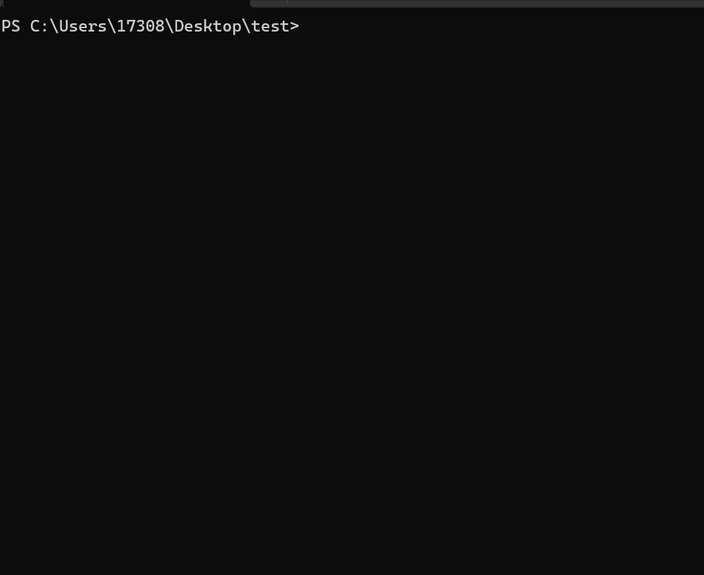

# create-tpl

[English](./README.md) | 简体中文

## ✨ Introduce

快速创建工具、Vue/React 等脚手架工具等应用模板，包括开箱即用的 Vitest 测试环境，以及配置好的 TS 和 Vite环境

你也可以使用这个工具快速创建开发 npm 库  或者 后端项目 模板，内置了 rollup 和 gulp 配置文件，都可以使用 TS 进行开发和打包


## 📦 Install

```bash
npm i -g @mazp/create-tpl
cnpm i -g @mazp/create-tpl
yarn add -g @mazp/create-tpl
pnpm add -g @mazp/create-tpl
```


## 🔨 Usage

### 创建项目

```bash
# create in the local folder
cra .
# create a new folder
cra <project-name>
```



### 下载插件

>   目前仅支持Vue/React框架，插件仅支持eslint
>
>   ❗：使用较少所以暂时不考虑添加更多的扩展

```bash
# include your chosen framework, install relative plugin
cra i eslint
```


