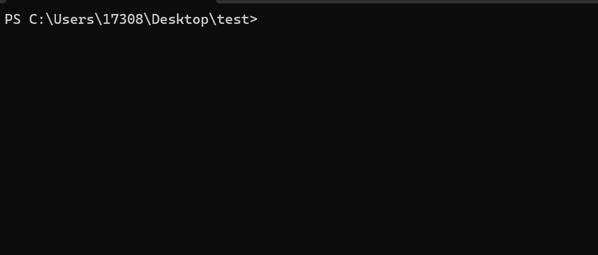
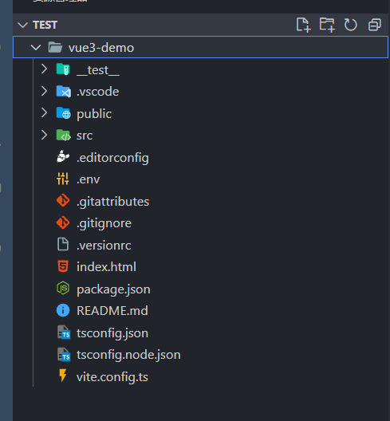

# create-tpl

English | [简体中文](./README-zh.md)

## ✨ Introduce

Quick creation tools, application templates such as Vue/React scaffolding tools, including out-of-the-box Vitest test environment, and configured TS and Vite environments

You can also use this tool to quickly create development npm library or backend project templates, with built-in rollup and gulp configuration files, all of which can be developed and packaged using TS


## 📦 Install

```bash
npm i -g @mazp/create-tpl
cnpm i -g @mazp/create-tpl
yarn add -g @mazp/create-tpl
pnpm add -g @mazp/create-tpl
```


## 🔨 Usage

### create project

```bash
# create in the local folder
cra .
# create a new folder
cra <project-name>
```





### create lib


### install plugin

>   Currently only supports Vue/React framework, plugin  only supports eslint
>
>   ❗: Less used so don't consider adding more extensions

```bash
# include your chosen framework, install relative plugin
cra i eslint
```


